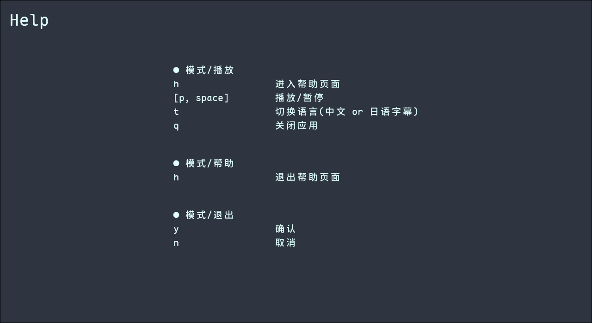

# deci-player

(WIP.)  

## Intro

A music-player written with rust + iced.  

## Showcase

  

  

  

## Roadmap

- [x] floating-blurred background
- [x] status line (volume, total duration, is_playing) 
- [x] multi-language lyrics
- [ ] simple-ui mode (or ui-less mode)
- [ ] audio visulization
- [ ] i18n
- [ ] animations for play/paused/next_song
- [ ] document for usage of `config.toml` file
- [ ] code optimized && improvement
